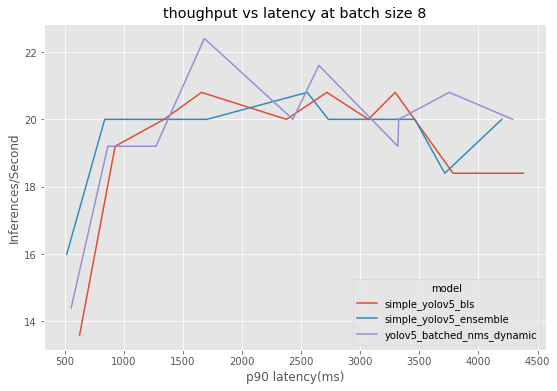
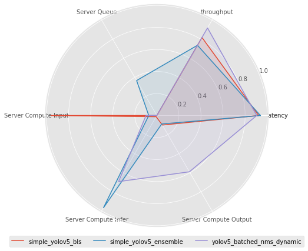

# YOLOV5 optimization on Triton Inference Server

在Triton中部署yolov5目标检测服务, 并分别进行了如下优化：
1. [轻量化Detect层的Output](./docs/custom_yolov5_detect_layer.md)
2. [集成TensorRT的BatchedNMSPlugin到engine中](./docs/batchedNMS.md)
3. [通过Triton Pipelines部署](./docs/pipelines.md)

其中Pipelines分别通过`Ensemble`和`BLS`两种方式来实现，Pipelines的infer模块是基于上述1中精简后的TensorRT Engine部署, Postprocess模块则通过Python Backend实现, 工作流参考[如何部署Triton Pipelines](./docs/pipelines.md#3-如何部署triton-pipelines)

--- 
## Environment
- CPU: 4cores  16GB
- GPU: Nvidia Tesla T4
- Cuda: 11.6
- TritonServer: 2.20.0
- TensorRT: 8.2.3
- Yolov5: v6.1


---

## Benchmark
一台机器部署Triton Inference Server, 在另外一台机器上通过Perf_analyzer通过gRPC调用接口, 对比测试`BLS Pipelines`、`Ensemble Pipelines`、`BatchedNMS`这三种部署方式在并发数逐渐增加条件下的性能表现。

- [生成真实数据](https://github.com/triton-inference-server/server/blob/main/docs/user_guide/perf_analyzer.md#real-input-data)

    ```shell
    python generate_input.py --input_images <image_path> ----output_file <real_data>.json
    ```


- 利用真实数据进行测试
  ```shell
  perf_analyzer  -m <triton_model_name>  -b 8  --input-data <real_data>.json  --concurrency-range 1:10  --measurement-interval 10000  -u <triton server endpoint> -i gRPC  -f <triton_model_name>.csv
  ```


数据显示`BatchedNMS`这一方式整体性相对更好，更快在并发数较大的情况下收敛到最优性能，在低时延下达到较高的吞吐; 而`Ensemble Pipelines`和`BLS Pipelines`则在并发数较小时性能更好，但是随着并发数的增加，性能下降的幅度更大。




选取了六个指标进行对比，每个指标均通过[处理](./triton/plot.ipynb#metrics-process)，并归一化到0-1区间，数值越大表示性能越好。每个指标的原始释义如下：

- Server Queue: 数据在Triton队列中的等待时间 
- Server Compute Input: Triton处理Input Tensor的时间
- Server Compute Infer: Triton执行推理的时间
- Server Compute Output: Triton处理Output Tensor的时间
- latency: 端到端延迟的90分位数
- throughput: 吞吐 



---

## REFERENCES


- [Ultralytics Yolov5](https://github.com/ultralytics/yolov5.git)
- [Yolov5 GPU Optimization](https://github.com/NVIDIA-AI-IOT/yolov5_gpu_optimization.git)
- [TensorRT BatchedNMSPlugin ](https://github.com/NVIDIA/TensorRT/tree/main/plugin/batchedNMSPlugin)
- [Perf Analyzer](https://github.com/triton-inference-server/server/blob/main/docs/user_guide/perf_analyzer.md)
- [Ensemble models](https://github.com/triton-inference-server/server/blob/main/docs/user_guide/architecture.md#ensemble-models)
- [Business Logic Scripting](https://github.com/triton-inference-server/python_backend#business-logic-scripting)