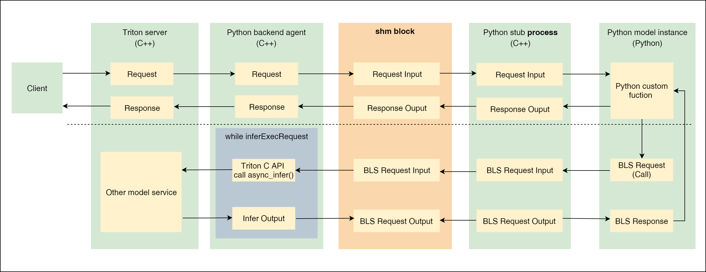

# Triton Pipeines的实现方式及对比

在[部署yolov5 Triton Pipelines](pipelines.md#2-triton-pipelines的实现方式)中，简单介绍了BLS和Ensemble这两种实现Triton Pipelines的方式，同时在[Benchmark](../README.md#benchmark)中，对两种Pipelines和[All in TensorRT Engine](./batchedNMS.md)的部署方式进行了性能测试，本文将对比介绍一下BLS和Ensemble, 同时对性能测试的结果进行解读

## 1 Python Backend

### 1.1 实现方式及结构
BLS是一种特殊的python backend，通过在python backend里调用其他模型服务来完成Pipelines。python backend的结构如下 


- 进程间通信IPC 

    由于GIL的限制，python backend通过对每个model instance起一个单独的进程(`python stub process(C++)`)来支持多实例部署。既然是多进程，那么就需要通过`shared memory`来完成python  model instance和Triton主进程之间的通信，具体为给每个python stub process在`shared memory里分配一个shm block`, shm block连接`python backend agent(C++)`来进行通信。


- 数据流向  

    `shm block`通过`Request MessageQ` 和 `Response MessageQ`调度和中转Input和Output, 上述两个队列均通过生产者-消费者模型的逻辑实现
    1. 发送到Triton server的request被`python backend agent(C++)`放到`Request MessageQ`  
    2. python stub process从`Request MessageQ`取出Input, 给到python model instance执行完推理后，将Output放到`Response MessageQ`
    3. `python backend agent(C++)`再从`Response MessageQ`中取出Output，打包成response返回给Triton server主进程
    

    示例如下: 
    ```python
    responses = []
    for request in requests:
        input_tensor = pb_utils.get_input_tensor_by_name(
            request, 'input')

        # INFER_FUNC is python backend core logic
        output_tensor = INFER_FUNC(input_tensor)

        inference_response = pb_utils.InferenceResponse(
            output_tensors=[out_tensor])
        responses.append(inference_response)
    ```

### 1.2 Notice 

- 需要手动管理Tensor在CPU还是GPU上，config中的`instance_group {kind: KIND_GPU}`不起作用
- 输入不会自动打batch, 需要手动将request列表转化为batch, 这点和所有backend一样
- 默认情况下，python backend主动将input tensor移动到CPU, 再提供给模型推理，将`FORCE_CPU_ONLY_INPUT_TENSORS`设置为`no`可以尽可能的避免host-device之间的内存拷贝
- python backend model instance与Triton server交换数据都是通过shared memory完成的，因此每个instance需要较大的shared memory, 至少64MB
- 如果性能成为瓶颈，特别是包含许多循环时，需要换成C++ backend


---

## 2 BLS
一种特殊的python backend，通过python code调用其他model service。使用场景：通过一些逻辑判断来动态组合已部署的模型服务

### 2.1 BLS流程



虚线上方表示调用python backend的一般方式, 虚线下方表示在python backend里调用其他model service。整体流程可以总结为: 


1. python model instance处理接受到的Input tensor
2. python model instance通过BLS call发起request，
3. request经过python stub process放到shm block
4. python backend agent将shm block里的BLS input拿出来, 并通过Triton C API将BLS input将input送到指定model上去执行推理
5. Triton python backend angent将推理得到的输出送到shm block
6. BLS Output 经过python stub process从shm block中取出，封装成BLS response并返回给python model instance

### 2.2 Notice

- Input tensor的位置  
默认情况下，python backend主动将input tensor移动到CPU, 再提供给模型推理，将`FORCE_CPU_ONLY_INPUT_TENSORS`设置为`no`可以避免这一行为，input tensor的位置取决于它最后是如何被处理的，因此开启此设置后，需要python backend能够同时处理CPU和GPU tensor

- 模块执行顺序  
BLS不支持step并行，step必须是顺序执行，前一个step执行完之后才执行后一个step

- 数据传输  
通过`DLPack`来编解码tensor，完成tensor在不同framework与python backend之间的数据传输，这一步是零拷贝，速度非常快


---
## 3 Ensemble

### 3.1 Ensemble概述
使用Ensemble来实现Pipelines可以避免传输中间张量的开销，并最大限度地减少必须发送到 Triton server的请求数量, 相对于BLS，Ensemble的优势在于可以将多个模型(step)的执行过程并行化(即每个step异步执行，真正意义的Pipelines)，从而提高整体性能。

一个典型的Ensemble Pipelines如下:
```
name: "simple_yolov5_ensemble"
platform: "ensemble"
max_batch_size: 8
input [
  {
    name: "ENSEMBLE_INPUT_0"
    data_type: TYPE_FP32
    dims: [3, 640, 640]
  }
]

output [
  {
    name: "ENSEMBLE_OUTPUT_0"
    data_type: TYPE_FP32
    dims: [ 300, 6 ]
  }
]

ensemble_scheduling {
  step [
    {
      model_name: "simple_yolov5"
      model_version: 1
      input_map: {
        key: "images"
        value: "ENSEMBLE_INPUT_0"
      }
      output_map: {
        key: "output"
        value: "FILTER_BBOXES"
      }
    },
    {
      model_name: "nms"
      model_version: 1
      input_map: {
        key: "candidate_boxes"
        value: "FILTER_BBOXES"
      }
      output_map: {
        key: "BBOXES"
        value: "ENSEMBLE_OUTPUT_0"
      }
    }
  ]
}
```
以上Pipelines包含[simple_yolov5](../triton/model_repository/simple_yolov5/config.pbtxt)和[nms](../triton/model_repository/nms/config.pbtxt)两个独立部署的model service，通过Ensemble将两个model service[串联起来](./pipelines.md#31-工作流)，simple_yolov5的输出作为nms的输入，nms的输出作为整个Pipelines的输出。每个input_map和output_map都是一个key-value对，key是每个model service的input/output name，value是Ensemble的input/output name。

### 3.2 Ensemble数据传输

- 如果Ensemble的所有子模型都是基于Triton内置framework backend部署的，子模型之间的数据可以通过CUDA API来进行点对点传输，不需要经过CPU内存拷贝

- 如果Ensemble的子模型使用了custom backend或python backend，则子模型之间的张量通信都是通过系统(CPU)的内存拷贝完成的, 即使python backend将`FORCE_CPU_ONLY_INPUT_TENSORS`设置为`no`，也无法避免这种内存拷贝。如下step，上一个step是通过tensorrt backend输出的output, 位于GPU上，在python backend中打印出来的input始终位于cpu，即这里发生了一步Device to Host的内存拷贝
    ```python
    for request in requests:

        before_nms = pb_utils.get_input_tensor_by_name(
            request, 'candidate_boxes')

        # always true
        print (f'nms pb_tensor is from cpu {before_nms.is_cpu()}', flush=True)
    ```
---
## 4 性能分析
数据来源: [Benchmark](../README.md#benchmark)

吞吐和时延是主要考虑的两个性能指标，时延三者差别不大，而在吞吐量上，`batched_nms_dynamic > Ensemble > BLS`， 原因为：
- batched_nms_dynamic的inference和nms全都包含在trt engine中了，layer之间通过CUDA API来传输，效率最高
-  Ensemble和BLS的inference和nms都是两个独立的model instance，其中BLS中python backend的Input tensor位于GPU上，而ensemble中的Input tensor被强制转换到CPU上，内存拷贝带来的开销比step并行执行的收益要大。因此在包含python backend的情况下，BLS的性能优于Ensemble